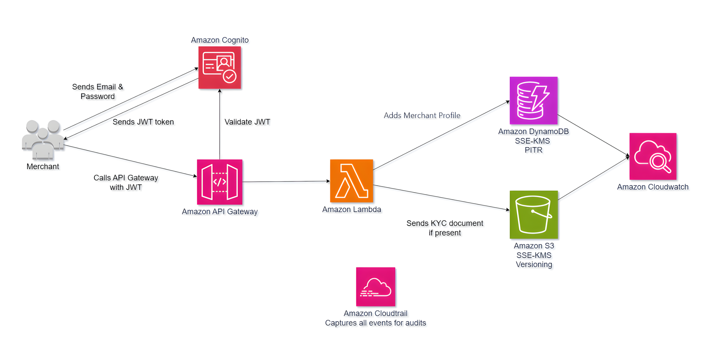

# AWS Merchant Onboarding API
 
**Serverless merchant registration API built to PCI DSS audit standards. Under $5/month at 10,000 users.**

## What This Is
 
A serverless merchant onboarding API built to survive a PCI DSS compliance audit without emergency rework.
 
Payment processors lose enterprise contracts when their infrastructure is not auditable. PCI DSS auditors check three things specifically: whether every data access event is logged, whether stored records are encrypted with a key the organization controls, and whether point-in-time recovery exists for dispute resolution. Most AWS implementations fail at least one of these on the first audit.
 
This API covers all three, with the cost evidence to show it can run at scale without over-provisioning.
 
---

## Architecture



---

## Key Engineering Decisions
 
### JWT validation at API Gateway, not Lambda
 
Authentication is enforced at the API Gateway layer via a Cognito authorizer. Lambda is never invoked for an unauthenticated request. This means no compute cost on rejected traffic and no attack surface for unauthenticated callers. Pushing JWT validation into Lambda moves the authentication boundary inward and increases blast radius.
 
### Customer-managed KMS key on DynamoDB
 
AWS-Owned Keys (the free default) fail PCI DSS Requirement 3.5.1 for a specific reason: CloudTrail does not log AWS-Owned Key usage. You cannot produce key access evidence for an auditor. Customer-managed keys generate a CloudTrail entry on every encrypt and decrypt operation. That is the audit evidence.
 
### S3 SSE-KMS with Bucket Key enabled
 
Without Bucket Key, every S3 object PUT and GET generates a separate KMS API call. At 8,000 S3 requests/month, that is 8,000 additional KMS calls stacked on top of DynamoDB operations. Bucket Key collapses per-object KMS calls into batch envelope encryption at the bucket level, significantly reducing both cost and KMS request quota consumption.
 
### GSI query instead of Scan for admin listing
 
The `GET /merchants` endpoint queries a Global Secondary Index rather than scanning the full table. DynamoDB Scan reads every item in the table regardless of what you need. At 300,000+ admin reads per month, Scan multiplies read capacity consumption by the full table size factor. The GSI reads only matching items.

### Duplicate registration enforced at the storage layer
 
```python
table.put_item(
    Item=item,
    ConditionExpression="attribute_not_exists(cac_number)",
)
```

A merchant's CAC number is unique to their business. This condition expression makes DynamoDB reject the write if that CAC number already exists. Enforced at the storage layer, not application logic which cannot be bypassed by a Lambda bug or a parallel request race condition.
 
### `entity_type` set server-side, not client-supplied
 
The GSI partition key is assigned by Lambda, not accepted from the request body. A crafted payload sending `entity_type: "ADMIN"` cannot pollute the index or escalate access.
 
 ### Input validation before any AWS SDK call
 
Email format, CAC number format, and required field presence are all validated before Lambda touches DynamoDB or KMS. Malformed requests never generate KMS decrypt operations, which keeps the cost model accurate and prevents unnecessary quota consumption.
 
### Point-in-Time Recovery (PITR) on DynamoDB
 
PITR provides continuous backups with one-second granularity for 35 days. In a payment dispute or fraud investigation, you need to prove what a merchant record looked like at a specific timestamp. Without PITR, you either rebuild from CloudTrail logs or you cannot answer the question. With PITR, it is a 30-second console operation.
 
---
 
## Cost Breakdown
 
> AWS Pricing Calculator export, March 2026, us-east-1. 10,000 MAU, 330,500 requests/month.
 
| Service | Monthly Cost | % of Bill | Notes |
|---|---|---|---|
| KMS | $2.01 | 41.3% | 669,000 symmetric API calls |
| API Gateway | $1.16 | 23.8% | 330,500 requests, avg 34KB |
| Lambda | $0.76 | 15.6% | 330,500 invocations, 512MB |
| CloudTrail | $0.34 | 7.0% | Lambda data events at volume |
| CloudWatch | $0.32 | 6.6% | 0.63GB log ingestion |
| DynamoDB | $0.24 | 4.9% | On-demand, PITR, SSE-KMS |
| S3 | $0.04 | 0.8% | 1GB storage, 8,000 requests |
| Cognito | $0.00 | 0.0% | 10,000 MAU within free tier |
| **Total** | **$4.87/month** | | |
 
**KMS is 41% of the bill.** The moment you add customer-managed encryption to DynamoDB and S3 (which PCI DSS requires), KMS becomes the dominant cost driver. Every DynamoDB read and write generates KMS API calls. Without Bucket Key on S3, every object operation adds to that count. This is the cost impact most engineers miss when scoping a PCI DSS compliant architecture.
 
---
 
 
## Traffic Model
 
| Dimension | Value | Basis |
|---|---|---|
| Monthly Active Users | 10,000 | Initial operating scale |
| New merchants/month | 500 | Growth estimate |
| DynamoDB writes/month | 500 | One write per registration |
| DynamoDB reads/month | 330,000 | 10k users × 3 reads + 500 records × 20 reads × 30 days |
| S3 PUTs/month | 2,000 | 500 merchants × 4 KYC documents |
| S3 GETs/month | 6,000 | 2,000 PUTs × 3 retrieval average |
| API Gateway + Lambda | 330,500 | Matches read/write totals |
 
---

## PCI DSS Compliance Notes
 
| Requirement | Control | Implementation |
|---|---|---|
| Req 3.5.1 | Encryption with customer-controlled key | Customer-managed KMS on DynamoDB and S3. AWS-Owned Keys produce no CloudTrail evidence |
| Req 8 | Every API call authenticated and tied to an identity | Cognito JWT validated at API Gateway before Lambda is invoked |
| Req 10 | Every data access event produces audit evidence | CloudTrail on all Lambda invocations, DynamoDB operations, and S3 object access |
 
---

## Scale Limits
 
Three things to revisit before 10x growth:
 
**CloudTrail cost at high Lambda data event volume.** CloudTrail logs Lambda data events at $0.10 per 100,000 events. At 330,500 invocations that is $0.34/month. At 33M invocations, $33/month. Model this before reaching that range.
 
**GSI read capacity under heavy admin query load.** 300,000 admin reads/month assumes moderate query frequency. If admin tooling increases, add DynamoDB DAX (DynamoDB Accelerator). DAX starts at $150+/month minimum instance size.
 
**KMS request quota.** KMS default quota is 5,500 symmetric requests/second in us-east-1. Not a constraint at this traffic model. At high-throughput payment processing scale, request the quota increase before hitting the ceiling.
 
---

 
## API Endpoints
 
| Method | Path | Description |
|---|---|---|
| POST | `/merchants` | Register a new merchant |
| GET | `/merchants` | Paginated admin listing (GSI query) |
| GET | `/merchants/{id}` | Retrieve a single merchant record |
 
All endpoints require a valid Cognito JWT in the `Authorization` header. Requests without a valid token are rejected at API Gateway before Lambda is invoked.
 
---
 
## Stack
 
| Layer | Service |
|---|---|
| Authentication | Amazon Cognito |
| API layer | Amazon API Gateway |
| Business logic | AWS Lambda (Python 3.14) |
| Merchant storage | Amazon DynamoDB (SSE-KMS, PITR, GSI, on-demand) |
| Document storage | Amazon S3 (SSE-KMS, Bucket Key, versioning) |
| Audit logging | AWS CloudTrail |
| Monitoring | Amazon CloudWatch |
| Encryption | AWS KMS (customer-managed) |
 
---

## Contact
 
**Victor Ogechukwu Ojeje** - Cloud Engineer 

Open to remote Cloud and SRE roles with infrastructure security depth.

*LinkedIn: [linkedin.com/in/victorojeje](linkedin.com/in/victorojeje) | GitHub: [github.com/escanut](github.com/escanut)
| Blog: [dev.to/escanut](dev.to/escanut)*
 

